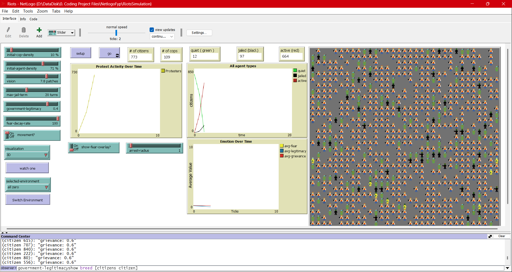

  

<h1 align="center">🧠 Agent_Zero Riot Simulation 🔥</h1>

  <b>NetLogo Implementation of Joshua Epstein’s Neurocognitive Agent Model</b>  

  

---

## 🧠 What is *Agent_Zero*?

Agent_Zero is not just a model. It’s a **neurocognitive framework** for generative social science, created by Joshua M. Epstein. It combines:
- **Cognitive components** (beliefs, perceptions)
- **Emotional components** (fear dynamics)
- **Social influence** (peer fear/grievance transmission)

This simulation brings *Agent_Zero* to life using **NetLogo**, focusing on **civil unrest** and **riot dynamics**.

---

## 🧩 Features

✅ Emotion-driven behavior (Fear-based activation)  
✅ Social contagion of fear and grievance  
✅ Dynamic legitimacy perception  
✅ Grievance formulation through hardship and policy legitimacy  
✅ Arrest mechanics & jail time  
✅ Toggleable overlays to visualize fear across the map  
✅ Adjustable parameters for fear, social influence, legitimacy erosion, etc.  

> **New**: Fully modular setup using scenario modes (`low-intensity`, `high-intensity`, `adaptive`) via UI button!
---

## 🧪 How to Run

### Requirements
- [NetLogo 6.3+](https://ccl.northwestern.edu/netlogo/)

### Steps
1. Clone or download this repository
2. Open `Riots.nlogo` in NetLogo
3. Set parameters or pick a **mode** from the interface
4. Click `Setup`, then `Go`

---

## 🔧 Customization

You can tweak:
- `fear_decay_rate`
- `social_influence_weight`
- `alpha`, `beta`, `gamma`, `k`
- arrest probability, jail time, and thresholds  
→ via sliders or dynamic mode buttons on the interface

Or jump into the code to try **new emotion models** like trust, anger, hope, etc.

---

## 📚 Background

Based on:
- *Agent_Zero: Toward Neurocognitive Foundations for Generative Social Science* by Joshua M. Epstein  
- *Growing Artificial Societies* by Epstein & Axtell

---

## 🛡️ License

This project is licensed under the MIT License. See the [LICENSE](LICENSE) file for details.

---

## 🙌 Contributing

Pull requests are welcome! Got an idea for a new emotion model? A better visualization? Drop a PR or open an issue.

---

## 🌐 Connect

- 💡 Want to collaborate? Drop a message!

  

> *"In the minds of many, fear takes root—not alone, but through the whispers of the crowd."*  
> – *Agent_Zero Simulation Chronicle*

---
